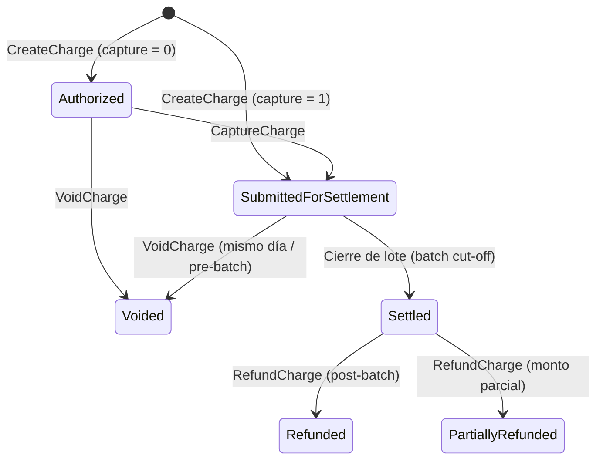

# Guía de Implementación Backend: Captura, Anulación y Reembolso de Cargos

Esta guía documenta la integración de las operaciones sobre cargos (`CaptureCharge`, `VoidCharge` y `RefundCharge`) utilizando el SDK de Go (`payarc-sdk-go`) en la capa de servicios o controladores de tu backend.

---

## 1. Ciclo de Vida de un Cargo en Payarc



### Reglas clave del ciclo de vida

1. **Autorización y Captura (Two-Step Payment)**:
   - Se crea el cargo con `inputs.ChargeInput{Capture: extra.False}`.
   - El cargo queda en estado autorizado esperando confirmación.
   - Se invoca `CaptureCharge` una vez preparado el pedido o prestado el servicio.
2. **Anulación (`VoidCharge`)**:
   - Cancela la transacción **antes de que se liquide el lote diario (pre-batch)**.
   - No hay movimiento de dinero real: se libera la retención sobre la tarjeta del cliente.
3. **Reembolso (`RefundCharge`)**:
   - Devuelve fondos al cliente **después de que la transacción fue liquidada (settled / batched)**.
   - Puede ser total (omitiendo `Amount` o pasando el total) o parcial (especificando un `Amount` menor al capturado).

---

## 2. Definición de Métodos del SDK

Todos los métodos están disponibles a través de la interfaz `payarcsdk.PayarcClient`:

```go
type PayarcClient interface {
    // ...
    CaptureCharge(chargeId string, input inputs.CaptureChargeDTO) (*outputs.ResponseCharge, error)
    VoidCharge(chargeId string, input inputs.VoidChargeDTO) (*outputs.ResponseCharge, error)
    RefundCharge(chargeId string, input inputs.RefundChargeDTO) (*outputs.ResponseCharge, error)
    // ...
}
```

---

## 3. Parámetros y DTOs de Entrada (`pkg/inputs`)

### 3.1. `CaptureChargeDTO`

Endpoint Payarc: `POST /v1/charges/{charge_id}/capture`

| Campo | Tipo | Requerido | Descripción |
| --- | --- | --- | --- |
| `Amount` | `*int` | Condicional | Monto a capturar en **centavos**. Obligatorio si se envía `TipAmount`. Si se omite, captura el monto autorizado. |
| `TipAmount` | `*int` | Opcional | Monto de propina adicional en **centavos**. |

### 3.2. `VoidChargeDTO`

Endpoint Payarc: `POST /v1/charges/{charge_id}/void`

| Campo | Tipo | Requerido | Descripción |
| --- | --- | --- | --- |
| `Reason` | `extra.VoidReason` | **Sí** | Motivo de la anulación. Valores: `requested_by_customer`, `fraudulent`, `duplicate`, `other`. |
| `VoidDescription` | `string` | Opcional | Descripción detallada de la anulación (mínimo 5 caracteres, máximo 190). |

### 3.3. `RefundChargeDTO`

Endpoint Payarc: `POST /v1/charges/{charge_id}/refunds`

| Campo | Tipo | Requerido | Descripción |
| --- | --- | --- | --- |
| `Amount` | `*int` | Opcional | Monto a reembolsar en **centavos**. Si se omite, se reembolsa el monto total del cargo. |
| `Reason` | `extra.RefundReason` | Opcional | Motivo del reembolso: `requested_by_customer`, `fraudulent`, `duplicate`, `other`. |
| `Description` | `string` | Opcional | Descripción de la causa del reembolso (5-190 caracteres). |
| `DoNotSendEmailToCustomer` | `extra.YesOrNo` | Opcional | `extra.Yes` para suprimir el correo automático de Payarc al cliente. |
| `DoNotSendSmsToCustomer` | `extra.YesOrNo` | Opcional | `extra.Yes` para suprimir el mensaje SMS automático al cliente. |

---

## 4. Tipos y Enumeraciones (`pkg/extra`)

```go
// Motivos para anular
extra.VoidReasonRequestedByCustomer // "requested_by_customer"
extra.VoidReasonFraudulent          // "fraudulent"
extra.VoidReasonDuplicate           // "duplicate"
extra.VoidReasonOther               // "other"

// Motivos para reembolsar
extra.RefundReasonRequestedByCustomer // "requested_by_customer"
extra.RefundReasonFraudulent          // "fraudulent"
extra.RefundReasonDuplicate           // "duplicate"
extra.RefundReasonOther               // "other"

// Banderas de notificación
extra.Yes // "yes"
extra.No  // "no"
```

---

## 5. Estructura de Respuesta (`pkg/outputs`)

Tanto `CaptureCharge`, `VoidCharge` como `RefundCharge` devuelven un `*outputs.ResponseCharge`:

```go
type ResponseCharge struct {
    Data     Charge   `json:"data"`
    Metadata Metadata `json:"meta,omitempty"`
}
```

### Campos clave de `Charge`

- `ID`: Identificador único del cargo (string alfanumérico de Payarc).
- `Status`: Estado actual (`submitted_for_settlement`, `settled`, `void`, `refunded`, etc.).
- `Amount`: Monto original de la transacción en centavos.
- `AmountCaptured`: Monto capturado acumulado en centavos.
- `AmountVoided`: Monto anulado en centavos.
- `AmountRefunded`: Monto reembolsado acumulado en centavos.
- `Captured`: Estado booleano (`res.Data.Captured.AsBool()`).
- `IsRefunded`: Indicador de reembolso (`res.Data.IsRefunded.AsBool()`).
- `AuthCode`: Código de autorización bancario.
- `HostReferenceNumber`: Número de referencia del procesador para conciliación y trazabilidad.

---

## 6. Patrón de Implementación en Backend (Capa de Servicio)

A continuación se muestra un ejemplo idiomático en Go de un servicio de backend que consume el SDK:

```go
package payments

import (
    "context"
    "errors"
    "fmt"
    "strings"

    payarcsdk "github.com/Ricardxdev/payarc-sdk-go/pkg"
    "github.com/Ricardxdev/payarc-sdk-go/pkg/extra"
    "github.com/Ricardxdev/payarc-sdk-go/pkg/inputs"
    "github.com/Ricardxdev/payarc-sdk-go/pkg/outputs"
)

type PaymentService struct {
    payarcClient payarcsdk.PayarcClient
}

func NewPaymentService(client payarcsdk.PayarcClient) *PaymentService {
    return &PaymentService{payarcClient: client}
}

// CaptureOrderPayment confirma y cobra una pre-autorización previa.
func (s *PaymentService) CaptureOrderPayment(ctx context.Context, chargeID string, amountCents int, tipCents int) (*outputs.Charge, error) {
    if strings.TrimSpace(chargeID) == "" {
        return nil, errors.New("el chargeID es requerido")
    }

    dto := inputs.CaptureChargeDTO{}
    if amountCents > 0 {
        dto.Amount = &amountCents
    }
    if tipCents > 0 {
        dto.TipAmount = &tipCents
    }

    resp, err := s.payarcClient.CaptureCharge(chargeID, dto)
    if err != nil {
        // Errores comunes de Payarc:
        // - "Charge Id does not exist" (404)
        // - "Cannot initiate capture as charge is already captured" (409)
        return nil, fmt.Errorf("fallo al capturar el cargo %s: %w", chargeID, err)
    }

    return &resp.Data, nil
}

// VoidOrderPayment anula un pago del mismo día antes del corte de lote.
func (s *PaymentService) VoidOrderPayment(ctx context.Context, chargeID string, reason extra.VoidReason, description string) (*outputs.Charge, error) {
    if strings.TrimSpace(chargeID) == "" {
        return nil, errors.New("el chargeID es requerido")
    }
    if reason == "" {
        reason = extra.VoidReasonRequestedByCustomer
    }

    dto := inputs.VoidChargeDTO{
        Reason:          reason,
        VoidDescription: description,
    }

    resp, err := s.payarcClient.VoidCharge(chargeID, dto)
    if err != nil {
        // Errores comunes:
        // - "Reversal Not Allowed." (409: el cargo ya fue liquidado, se debe reembolsar en su lugar)
        return nil, fmt.Errorf("fallo al anular el cargo %s: %w", chargeID, err)
    }

    return &resp.Data, nil
}

// RefundOrderPayment procesa un reembolso total o parcial para transacciones liquidadas.
func (s *PaymentService) RefundOrderPayment(ctx context.Context, chargeID string, amountCents *int, reason extra.RefundReason, description string, notifyCustomer bool) (*outputs.Charge, error) {
    if strings.TrimSpace(chargeID) == "" {
        return nil, errors.New("el chargeID es requerido")
    }

    dto := inputs.RefundChargeDTO{
        Amount:      amountCents,
        Reason:      reason,
        Description: description,
    }

    if !notifyCustomer {
        dto.DoNotSendEmailToCustomer = extra.Yes
        dto.DoNotSendSmsToCustomer = extra.Yes
    }

    resp, err := s.payarcClient.RefundCharge(chargeID, dto)
    if err != nil {
        // Errores comunes:
        // - "Return Not Allowed." (422: el cargo no ha sido liquidado aún, se debe anular con Void)
        return nil, fmt.Errorf("fallo al reembolsar el cargo %s: %w", chargeID, err)
    }

    return &resp.Data, nil
}
```

---

## 7. Manejo de Errores y Casos Límite

| Código HTTP API | Mensaje de Error Típico | Diagnóstico y Acción Recomendada |
| --- | --- | --- |
| **404 Not Found** | `Charge Id does not exist` | El identificador de cargo no es válido en el entorno (verificar si pertenece a sandbox o producción). |
| **409 Conflict** | `Cannot initiate capture as charge is already captured` | El cargo ya fue capturado con anterioridad o ya se completó como `Sale` directa. |
| **409 Conflict** | `Reversal Not Allowed.` | Se intentó hacer `Void` a un cargo que ya fue liquidado (batch cerrado). **Acción:** llamar a `RefundCharge`. |
| **422 Unprocessable** | `Return Not Allowed.` | Se intentó hacer `Refund` a un cargo que aún no se liquida (batch abierto del mismo día). **Acción:** llamar a `VoidCharge`. |
| **422 Unprocessable** | `The reason field is required.` | No se especificó el campo `Reason` en la anulación. |
